# CUDA-Based-Fast-and-Accurate-Image-Feature-Matching-for-Large-Scale-Dataset

(Date: 12/13/2016)

# Background

Image matching is one of the most crucial stage in object recognition/classification, motion estimation and image indexing.
For this project, I typically focus on fast and accurate Image Matching for motion estimation. 
To achieve fast and reliable indoor/outdoor localization and navigation, one cannot rely on sensors that is constrained by lighting conditions and range limitations. 
Without a GPS, using only RGB cameras, the Structure from Motion (SfM) will still allow one recover the three-dimensional structural information based on the correspondences between two dimensional images.

My former research at the Chinese Academy of Science in the National Lab of Pattern Recognition in 2015 improved the state of the art image matching, hash based algorithm for SfM. 
The original algorithm which is based on Locality Sensitive Hashing (LSH), accelerates 10 times or more than KD tree on a single CPU [1]. The improved algorithm typically allowed for an implementation that improves the precision rate from 20 to 55 percent with no loss in efficiency. 
In today's "big data" regime, we hope to have a broader contribution to the subfields including object recognition/classification, motion estimation and image indexing.
An example of ‘large scale’ dataset: ~1000 camera pictures for a scene,~ 6000 features per image on average, number of all image pairs =500*999

# Algorithm Overview

* Original image Matching Pipeline [1]
** Multi table (L tables) Hashing (feature descriptors (eg. SIFT (128 integers) binary hash codes (128 bits * L) )
** Candidates Look-up &Fetching O(L) 
* Candidates ranking O(k : number of candidates) in Hamming space
* Final validation in Euclidean space

Algorithm review (1)  | Algorithm review (2)
:-------------------------:  |:-------------------------: 
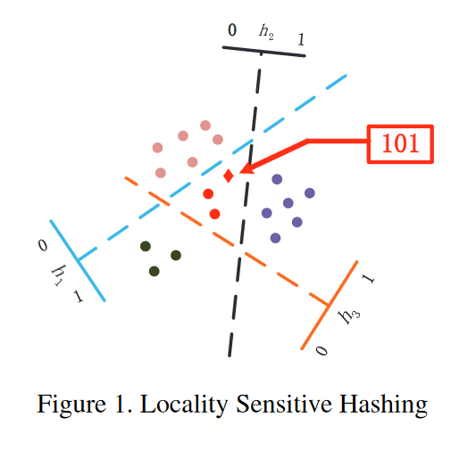  | 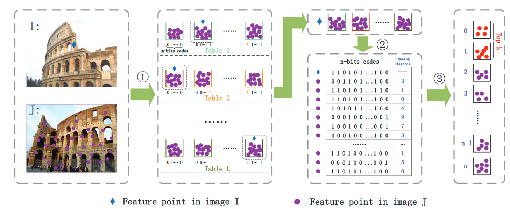 

Source from [1], http://www.cv-foundation.org/openaccess/content_cvpr_2014/papers/Cheng_Fast_and_Accurate_2014_CVPR_paper.pdf

# Algorithm Overview II

* Structure from Motion Pipeline

The slides from Prof. Jianbo Shi that best describes this http://cis.upenn.edu/~cis580/Spring2016/Lectures/cis580-18-coursera-2016-SfM-fulll.pdf

# GPU implementation details

* Optimization: Global shared buffers for data storage + buffers per thread for quick sorting of candidate list 
* More descriptions comming soon.

# Sample results

Sample Result (1)  | Sample Result (2)
:-------------------------:  |:-------------------------: 
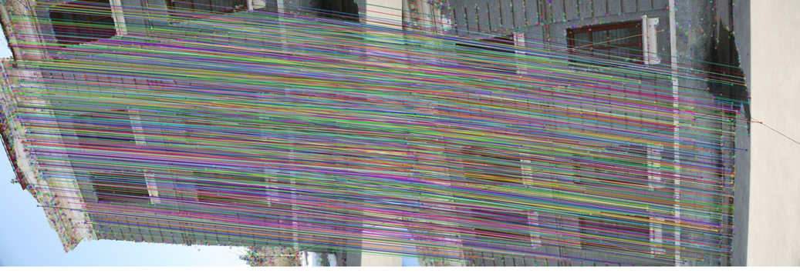 |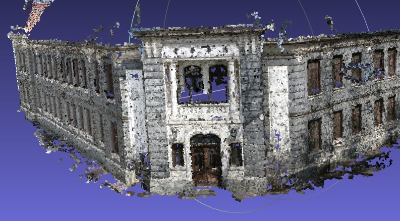

Tsinghua Database, 1
http://vision.ia.ac.cn/data/index.html

# Performance Analysis

* Sparsity of data structure (number of hash bits) vs. total time consumed vs. speed up  

* Testing on three implementations: original algorithm on CPU, GPU, and slightly improved GPU version that borrows some ideas mentioned in my new draft of paper (not submitted yet).

8 bits, 6 tables t| 8 bits, 6 tables
:-------------------------:  |:-------------------------: 
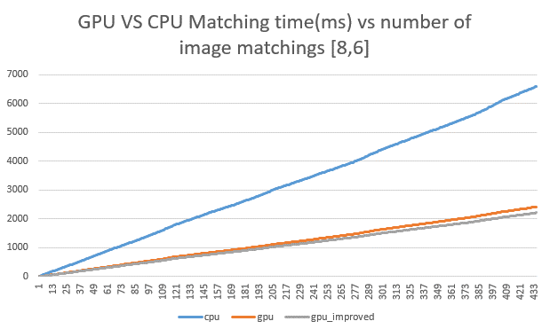  | 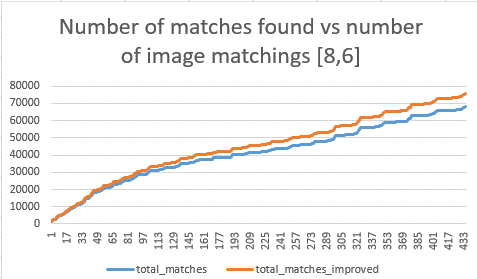 

10 bits, 6 tables | 10 bits, 6 tables
:-------------------------:  |:-------------------------: 
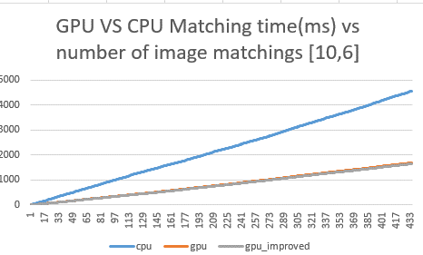  | 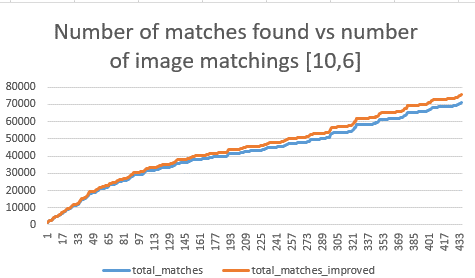 

12 bits, 6 tables | 12 bits, 6 tables
:-------------------------:  |:-------------------------: 
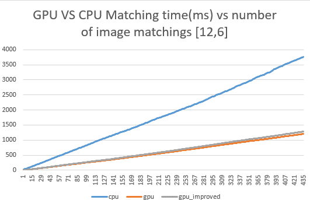  | 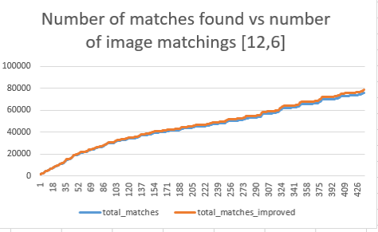 

# In summary

Increased sparsity vs. time (three implementations) | Increased sparsity vs increased speed up on GPU
:-------------------------:  |:-------------------------: 
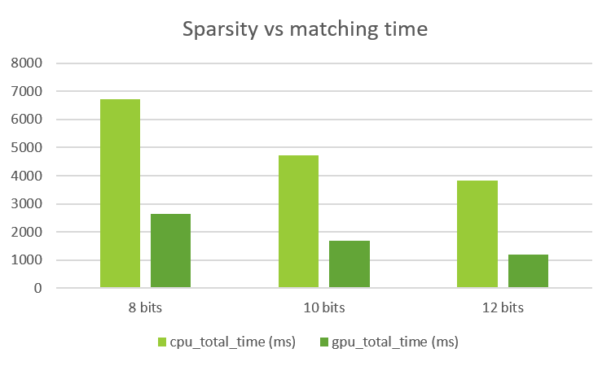  | 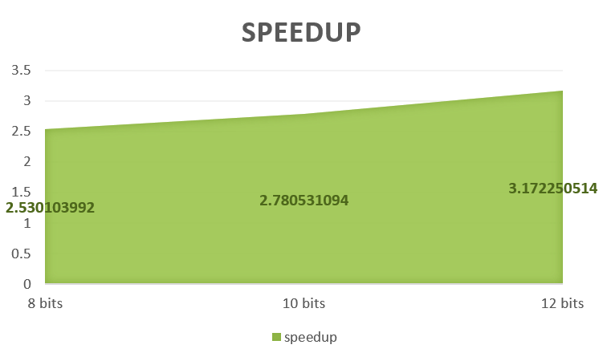 

# SfM demos on Large dataset

* Sparse clouds

Taj.Mahal  

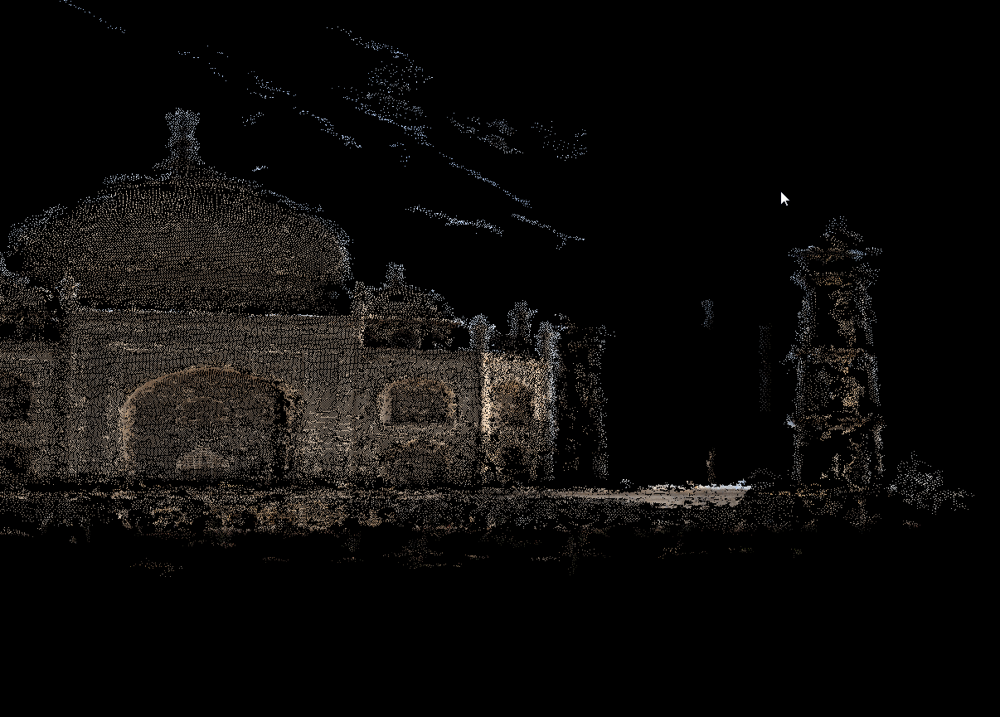 

Tsinghua.Life.Science 

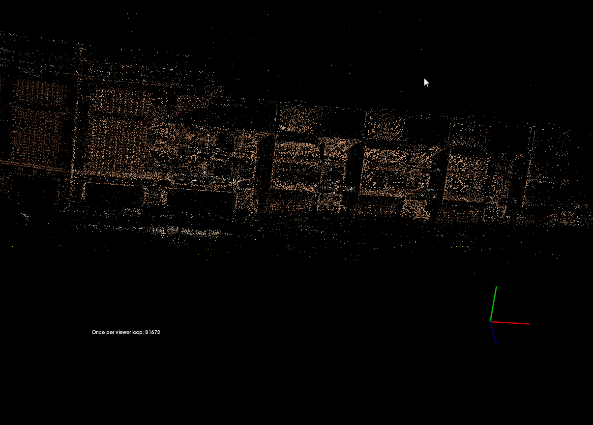

Dataset sources: 

1. Flickr Database
2. http://vision.ia.ac.cn/data/index.html
