# CUDA-Based-Fast-and-Accurate-Image-Feature-Matching-for-Large-Scale-Dataset

## Xiang Deng
## https://github.com/dengxianga/dengxianga.github.io

(Date: 12/13/2016)

# Background

Image matching is one of the most crucial stage in object recognition/classification, motion estimation and image indexing.
For this project, I typically focus on fast and accurate Image Matching for motion estimation. 
To achieve fast and reliable indoor/outdoor localization and navigation, one cannot rely on sensors that is constrained by lighting conditions and range limitations. 
Without a GPS, using only RGB cameras, the Structure from Motion (SfM) will still allow one recover the three-dimensional structural information based on the correspondences between two dimensional images.

My former research at the Chinese Academy of Science in the National Lab of Pattern Recognition in 2015 improved the state of the art image matching, hash based algorithm for SfM. 
The original algorithm which is based on Locality Sensitive Hashing (LSH), accelerates 10 times or more than KD tree on a single CPU [1]. The improved algorithm typically allowed for an implementation that improves the precision rate from 20 to 55 percent with no loss in efficiency. 
In today's "big data" regime, we hope to have a broader contribution to the subfields including object recognition/classification, motion estimation and image indexing.
An example of ‘large scale’ dataset: ~1000 camera pictures for a scene,~ 6000 features per image on average, number of all image pairs =500*999


# Algorithm Overview

* The original image Matching Pipeline [1] can be broke down into four major stages:
** Multi table (L tables) Hashing (feature descriptors (eg. SIFT (128 integers) binary hash codes (128 bits * L) )
** Candidates Look-up &Fetching O(L) 
** Candidates ranking O(k : number of candidates) in Hamming space
** Final validation in Euclidean space

Algorithm review (1)  | Algorithm review (2)
:-------------------------:  |:-------------------------: 
  |  

Source from [1], http://www.cv-foundation.org/openaccess/content_cvpr_2014/papers/Cheng_Fast_and_Accurate_2014_CVPR_paper.pdf


# Algorithm Overview II

* Structure from Motion Pipeline

The slides from Prof. Jianbo Shi that best describes this http://cis.upenn.edu/~cis580/Spring2016/Lectures/cis580-18-coursera-2016-SfM-fulll.pdf

# GPU implementation details

* Optimization: I used two techniques for quick candidate fetching and ranking: global shared buffers for data storage + buffers per thread for quick sorting of candidate list 
The motivation for using globaling shared buffers is to store feature information (SIFT and Hash) in more place, and re-use them more efficiently. For example, to do full matching of 
700 hundred images, we will have 700*699/2 image matching pairs, but we only have to preallocate memories and store feature informations for 700 image data.
Quantized linked lists: In my implementation, the hamming distance are naturally integer values range from 0 to 127, in the quantized linked list datastrucure
 we have 128 buckets, with each bucket point to a list of candidates, i.e. the first bucket links to the candidates that are 0 hamming distance to the target hash code.
In this way, the candidates are automatically sorted.

# Sample results

Sample Result (1)  | Sample Result (2)
:-------------------------:  |:-------------------------: 
 |

Tsinghua Database, 1
http://vision.ia.ac.cn/data/index.html

# Performance Analysis

* We typically concern with the sparsity of datastructure vs. the performance and speed up by GPU.
The sparity is charesterized by the number of hash bits we are using. The reasoning we are concerning about the sparsity is because
of the hash table structure: since all sift points are projected and quantized into hash codes, by controlling the 
number of hash bits, similar features are more or less likely to be projected into a same hash bucket, which contains pointer to the candidate list.
 The following are the testing results:

* Sparsity of data structure (number of hash bits) vs. total time consumed vs. speed up  

* Testing on three implementations: original algorithm on CPU, GPU, and slightly improved GPU version that borrows some ideas mentioned in my new draft of paper (not submitted yet).

8 bits, 6 tables t| 8 bits, 6 tables
:-------------------------:  |:-------------------------: 
  |  

10 bits, 6 tables | 10 bits, 6 tables
:-------------------------:  |:-------------------------: 
  |  

12 bits, 6 tables | 12 bits, 6 tables
:-------------------------:  |:-------------------------: 
  |  

# In summary

Increased sparsity vs. time (three implementations) | Increased sparsity vs increased speed up on GPU
:-------------------------:  |:-------------------------: 
  |  

# SfM demos on Large dataset

* Sparse clouds

Taj.Mahal  

 

Tsinghua.Life.Science 


Dataset sources: 

1. Flickr Database
2. http://vision.ia.ac.cn/data/index.html

# Debugging Views

## Debug CPU vs GPU 

* Text output

** Comparing number of matches found
** Comparing timing
** outputing average number of features per query image

```
cntPoint 7718
gpu match time 6.834176 ms
num match found Gpu_I 769
test Match images
gpu match time 6.563840 ms
num match found Gpu_II 808
cpu time lapsed 20.000000 ms
num match found cpu 769
cntPoint 6251
gpu match time 4.924416 ms
num match found Gpu_I 3
test Match images
gpu match time 4.724736 ms
num match found Gpu_II 3
cpu time lapsed 17.000000 ms
num match found cpu 3
cntPoint 8102
gpu match time 7.697408 ms
num match found Gpu_I 3
test Match images
gpu match time 7.506944 ms
num match found Gpu_II 3
cpu time lapsed 26.000000 ms
num match found cpu 3
cntPoint 4029
gpu match time 2.837504 ms
num match found Gpu_I 1
test Match images
gpu match time 2.728960 ms
num match found Gpu_II 2
cpu time lapsed 9.000000 ms
num match found cpu 1
cntPoint 6037
gpu match time 4.655104 ms
num match found Gpu_I 3
test Match images
gpu match time 4.531200 ms
num match found Gpu_II 5
cpu time lapsed 15.000000 ms
num match found cpu 3
cntPoint 6405
gpu match time 5.369856 ms
num match found Gpu_I 9
test Match images
gpu match time 5.252096 ms
num match found Gpu_II 12
cpu time lapsed 15.000000 ms
num match found cpu 9
cntPoint 7205
gpu match time 5.899264 ms
num match found Gpu_I 3
test Match images
gpu match time 5.738496 ms
num match found Gpu_II 8
cpu time lapsed 18.000000 ms
num match found cpu 3
cntPoint 4703
gpu match time 3.277824 ms
num match found Gpu_I 2
test Match images
gpu match time 3.173376 ms
num match found Gpu_II 4
cpu time lapsed 12.000000 ms
num match found cpu 2
cntPoint 4999
gpu match time 3.263488 ms
num match found Gpu_I 0
test Match images
gpu match time 3.128320 ms
num match found Gpu_II 1
cpu time lapsed 13.000000 ms
num match found cpu 0
cntPoint 5818
gpu match time 4.858880 ms
num match found Gpu_I 5
test Match images
gpu match time 4.536320 ms
num match found Gpu_II 6
cpu time lapsed 15.000000 ms
num match found cpu 5
cntPoint 4643
gpu match time 3.134464 ms
num match found Gpu_I 6
test Match images
gpu match time 3.034112 ms
num match found Gpu_II 9
cpu time lapsed 14.000000 ms
num match found cpu 6
cntPoint 5328
gpu match time 3.915776 ms
num match found Gpu_I 5
test Match images
gpu match time 3.758080 ms
num match found Gpu_II 8
cpu time lapsed 13.000000 ms
num match found cpu 5
cntPoint 4440
gpu match time 3.105792 ms
num match found Gpu_I 1
test Match images
gpu match time 2.979840 ms
num match found Gpu_II 3
cpu time lapsed 11.000000 ms
num match found cpu 1
cntPoint 3398
gpu match time 2.606080 ms
num match found Gpu_I 2
test Match images
gpu match time 2.582528 ms
num match found Gpu_II 6
cpu time lapsed 8.000000 ms
num match found cpu 2
cntPoint 4239
gpu match time 2.716672 ms
num match found Gpu_I 0
test Match images
gpu match time 2.686976 ms
num match found Gpu_II 3
cpu time lapsed 10.000000 ms
num match found cpu 0
cntPoint 8515
gpu match time 8.288256 ms
num match found Gpu_I 932
test Match images
gpu match time 8.228864 ms
num match found Gpu_II 959
cpu time lapsed 21.000000 ms
num match found cpu 932
```

* Image Output

Matches: CPU pipline | Matches: GPU pipeline
:-------------------------:  |:-------------------------: 
  | 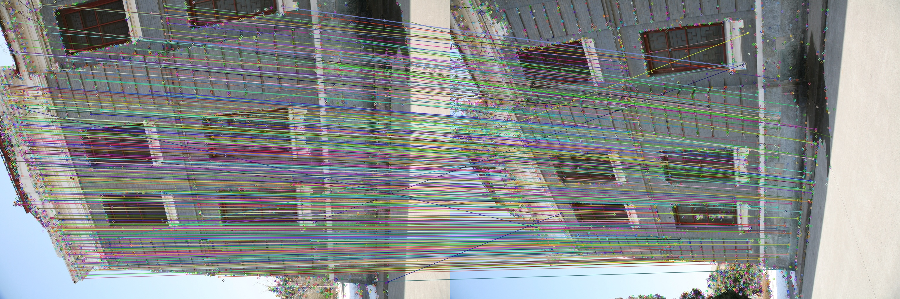 

Matches: CPU pipline | Matches: GPU pipeline
:-------------------------:  |:-------------------------: 
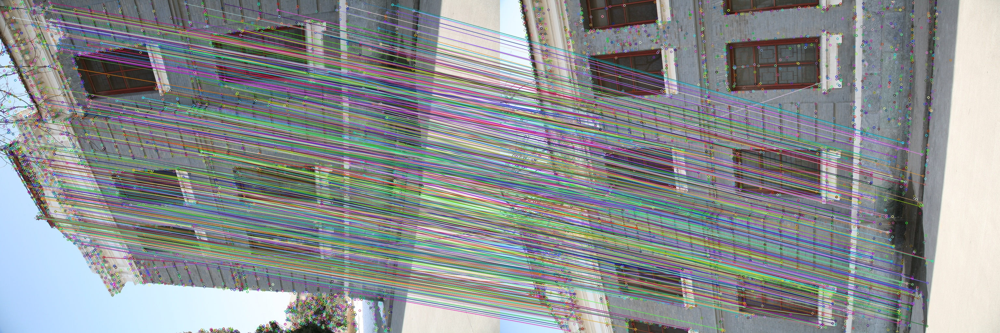  | 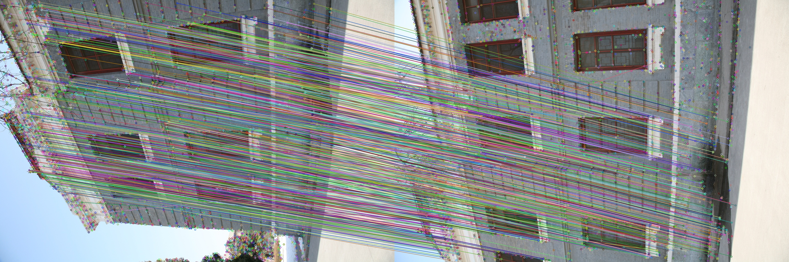 

Matches: CPU pipline | Matches: GPU pipeline
:-------------------------:  |:-------------------------: 
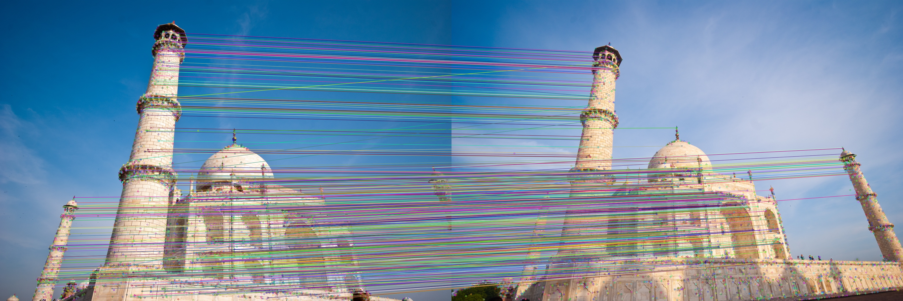  | 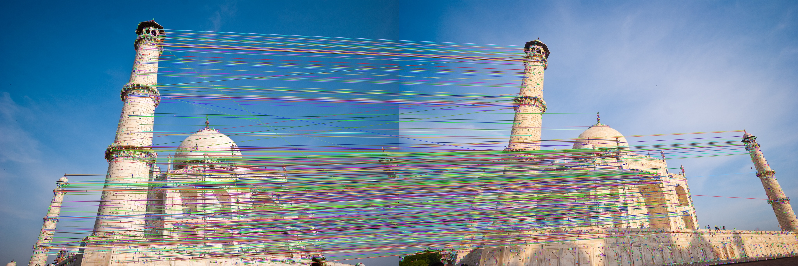 

Matches: CPU pipline | Matches: GPU pipeline
:-------------------------:  |:-------------------------: 
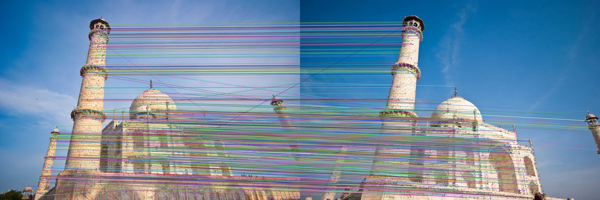  | 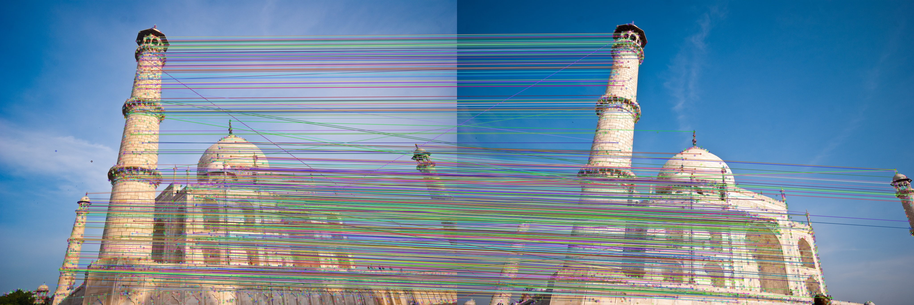 

Matches: CPU pipline | Matches: GPU pipeline
:-------------------------:  |:-------------------------: 
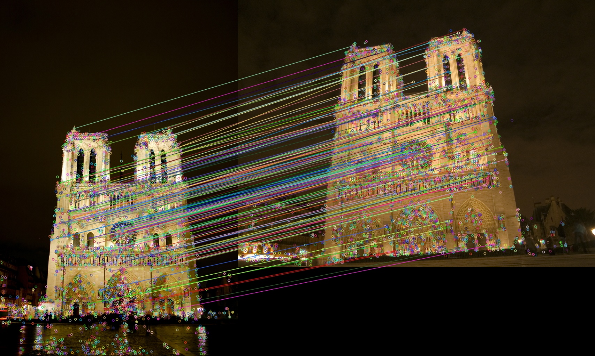  | 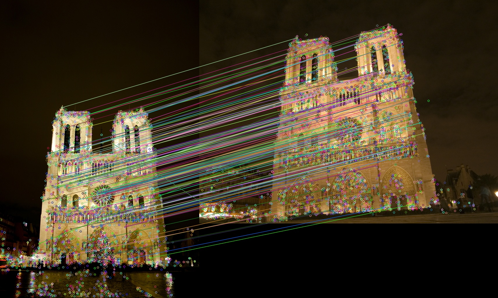 

Matches: CPU pipline | Matches: GPU pipeline
:-------------------------:  |:-------------------------: 
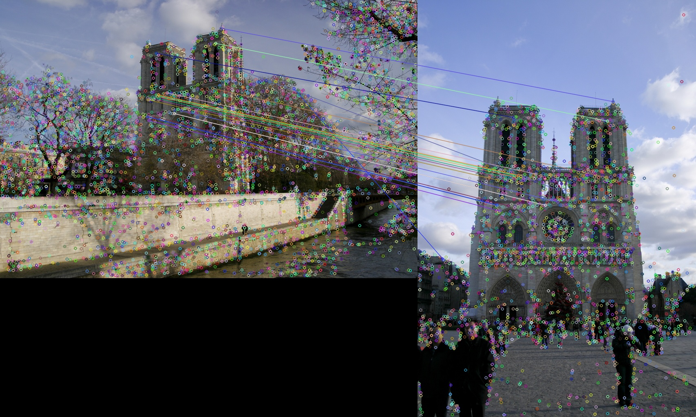  | 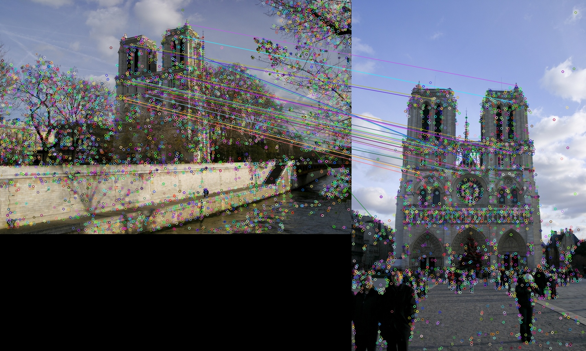 

# Build Intructions

** Toolboxes needed: 1. OpenCV (for visual debugging) 2. PCL (optional, for visualizing point cloud)
**  