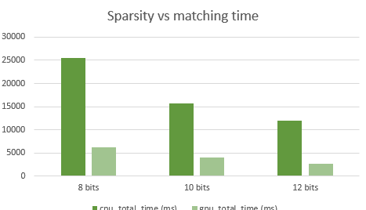

# CUDA-Based-Fast-and-Accurate-Image-Feature-Matching-for-Large-Scale-Dataset

## Xiang Deng
	* https://github.com/dengxianga/dengxianga.github.io

(Date: 12/15/2016)
Updated: 12/19/2016

# Background

Image matching is one of the most crucial stage in object recognition/classification, motion estimation and image indexing.
For this project, I typically focus on fast and accurate Image Matching for motion estimation. 
To achieve fast and reliable indoor/outdoor localization and navigation, one cannot rely on sensors that is constrained by lighting conditions and range limitations. 
Without a GPS, using only RGB cameras, the Structure from Motion (SfM) will still allow one recover the three-dimensional structural information based on the correspondences between two dimensional images.

My former research at the Chinese Academy of Science in the National Lab of Pattern Recognition in 2015 improved the state of the art image matching, hash based algorithm for SfM. 
The original algorithm which is based on Locality Sensitive Hashing (LSH), accelerates 10 times or more than KD tree on a single CPU [1]. The improved algorithm typically allowed for an implementation that improves the precision rate from 20 to 55 percent with no loss in efficiency. 
In today's "big data" regime, we hope to have a broader contribution to the subfields including object recognition/classification, motion estimation and image indexing.
An example of ‘large scale’ dataset: ~1000 camera pictures for a scene,~ 6000 features per image on average, number of all image pairs =500*999

 
 

# Algorithm Overview

* The original image Matching Pipeline [1] can be broke down into four major stages:

	* Multi table (L tables) Hashing (feature descriptors (eg. SIFT (128 integers) binary hash codes (128 bits * L) )

	* Candidates Look-up &Fetching O(L) 

	* Candidates ranking O(k : number of candidates) in Hamming space

	* Final validation in Euclidean space

Algorithm review (1)  | Algorithm review (2)
:-------------------------:  |:-------------------------: 
  |  

Source from [1], http://www.cv-foundation.org/openaccess/content_cvpr_2014/papers/Cheng_Fast_and_Accurate_2014_CVPR_paper.pdf


# Algorithm Overview II

* Structure from Motion Pipeline

The slides from Prof. Jianbo Shi that best describes this http://cis.upenn.edu/~cis580/Spring2016/Lectures/cis580-18-coursera-2016-SfM-fulll.pdf

# GPU implementation details

Besides the basic implementations of the original paper on LSH image matching (as well as an improved GPU implementation), I typically concern about optimization.

* Optimization: I used two techniques for quick candidate fetching and ranking: global shared buffers for data storage + buffers per thread for quick sorting of candidate list 
The motivation for using globaling shared buffers is to store feature information (SIFT and Hash) in more place, and re-use them more efficiently. For example, to do full matching of 
700 hundred images, we will have 700*699/2 image matching pairs, but we only have to preallocate memories and store feature informations for 700 image data.
Quantized linked lists: In my implementation, the hamming distance are naturally integer values range from 0 to 127, in the quantized linked list datastrucure
 we have 128 buckets, with each bucket point to a list of candidates, i.e. the first bucket links to the candidates that are 0 hamming distance to the target hash code.
In this way, the candidates are automatically sorted.

# Sample results

Sample Result (1)  | Sample Result (2)
:-------------------------:  |:-------------------------: 
 |

Tsinghua Database, 1
http://vision.ia.ac.cn/data/index.html

# Performance Analysis

* We typically concern with the sparsity of datastructure vs. the performance and speed up by GPU.
The sparity is charesterized by the number of hash bits we are using. The reasoning we are concerning about the sparsity is because
of the hash table structure: since all sift points are projected and quantized into hash codes, by controlling the 
number of hash bits, similar features are more or less likely to be projected into a same hash bucket, which contains pointer to the candidate list.
 
The following are the testing results (dataset: qinghuaxuetang):

* Sparsity of data structure (number of hash bits) vs. total time consumed vs. speed up  

	* Testing on three implementations: original algorithm on CPU, GPU, and slightly improved GPU version that aims to enhance the likelihood of finding the 
true match in the candidate list; such minor improvement borrows some ideas mentioned in my new draft of paper (not submitted yet).

8 bits, 6 tables t| 8 bits, 6 tables
:-------------------------:  |:-------------------------: 
  |  

10 bits, 6 tables | 10 bits, 6 tables
:-------------------------:  |:-------------------------: 
  |  

12 bits, 6 tables | 12 bits, 6 tables
:-------------------------:  |:-------------------------: 
  |  

* From the above testing results: 1. as the number of hash bits (sparsity) increases, the GPU speed up faster. This 
makes sense because as the number of candidates being reduced per bucket, the computational load on the GPU side is 
reduced relatively faster to the CPU performance. (in other words, the GPU has more disadvantage in the latency of compuation) Altough both approaches are becoming faster. (Each thread computes its own feature matching for each individual query hash code)
One the other hand, we need to look at the precision performance. Altough it doesn't shows a pattern that the precision (represented by
number of matches) is becoming reduced as the sparsity increases, we can observed a decreased performance in the improved precision algorithm.
One underlying reasoning is because as the data structure become more and more sparse, the potential of successfuly finding the truc match is being reduced. 
The improved algorithm requires the true candidate at least to appear in the candidate list.

The figure above best summaries the analysis above.

# In summary

Increased sparsity vs. time (three implementations) | Increased sparsity vs increased speed up on GPU
:-------------------------:  |:-------------------------: 
  |  

* Upon the testing on another dataset: norte dame, we can observe a similar pattern:

8 bits, 6 tables t| 8 bits, 6 tables
:-------------------------:  |:-------------------------: 
  |  

10 bits, 6 tables | 10 bits, 6 tables
:-------------------------:  |:-------------------------: 
  |  

12 bits, 6 tables | 12 bits, 6 tables
:-------------------------:  |:-------------------------: 
  |  

Increased sparsity vs. time (three implementations) | Increased sparsity vs increased speed up on GPU
:-------------------------:  |:-------------------------: 
  |  

	* Analysis on the difference: in this case we do see a saturation of the speed up. This is essentially because that
	the dataset norte dame from the Flickr contains the photos that are much more randomly taken by various touriests. Whereas the tsinghua dataset contains images
	that are much more uniformly taken by a same camera in a smaller scene. In most case,
	due to the difference in scaling, lighting and angle, it's less likely to find two images that are "close" to each other. In light of this reasoning,
	we can see that the candidate list of feature matching will be a lot shorter. Because of this reason, the sparsity of the datastructure saturates earlier as we increase the number of bits.

* Update on linked list buffers: using Dynamic Memory Allocation instead of preallocated memory, here is the improvement on "qinghuaxuetang" :

8 bits, 6 tables t| 8 bits, 6 tables | 12 bits, 6 tables
:-------------------------:  |:-------------------------:  |:-------------------------: 
  |  |  

Increased sparsity vs. time (three implementations) | Increased sparsity vs increased speed up on GPU
:-------------------------:  |:-------------------------: 
  |  

* Memory optimization continued: I further breakdown my buffer data structure into independent buffers instead, here is the most recent improvement:

Increased sparsity vs. time (three implementations) | Increased sparsity vs increased speed up on GPU
:-------------------------:  |:-------------------------: 
  |  
	   
* Why CUDA doesn't accelerates a lot (eg. 100 to 1000 times)?
	* A probable reason is because of the compuation of hamming distance only requires 1 or 2 CPU/GPU cycles, while the time consumed by writing the result to memory 
	can't really be ignored in this case. In a typical benchmark (1000 features with an average of 20 hamming distance computation per feature), writing results to global memory slows down by 10x or more! (0.037248ms vs 0.003520ms).

	
# SfM demos on Large dataset

* Sparse clouds

Taj.Mahal  | Tsinghua.Life.Science
:-------------------------:  |:-------------------------: 
  |

* Dense clouds

Norte Dame  | Statue of Liberty
:-------------------------:  |:-------------------------: 
  | 
 
Tsinghuamen  | Tsinghuaxuetang
 :-------------------------:  |:-------------------------: 
  | 
 
 
 Tsinghuamen  | Tsinghuaxuetang
 :-------------------------:  |:-------------------------: 
  | 
  | 
  
Dataset sources: 

1. Flickr Database
2. http://vision.ia.ac.cn/data/index.html

# Debugging Views

## Debug CPU vs GPU 

* Text output

	* Comparing number of matches found

	* Comparing timing

	* Outputing average number of features per query image


```
cntPoint 4845
gpu match time 3.086336 ms
num match found Gpu_I 396
test Match images
gpu match time 2.968576 ms
num match found Gpu_II 412
cpu time lapsed 9.000000 ms
num match found cpu 396
cntPoint 4443
gpu match time 3.197952 ms
num match found Gpu_I 645
test Match images
gpu match time 3.101696 ms
num match found Gpu_II 648
cpu time lapsed 10.000000 ms
num match found cpu 645
cntPoint 4845
gpu match time 2.891776 ms
num match found Gpu_I 17
test Match images
gpu match time 2.871296 ms
num match found Gpu_II 22
cpu time lapsed 10.000000 ms
num match found cpu 17
cntPoint 4443
gpu match time 3.067904 ms
num match found Gpu_I 123
test Match images
gpu match time 3.000320 ms
num match found Gpu_II 138
cpu time lapsed 10.000000 ms
num match found cpu 123
cntPoint 4443
gpu match time 2.976768 ms
num match found Gpu_I 721
test Match images
gpu match time 2.882560 ms
num match found Gpu_II 738
cpu time lapsed 10.000000 ms
num match found cpu 721
```

* Image Output

Matches: CPU pipline | Matches: GPU pipeline
:-------------------------:  |:-------------------------: 
  |  

Matches: CPU pipline | Matches: GPU pipeline
:-------------------------:  |:-------------------------: 
  |  

Matches: CPU pipline | Matches: GPU pipeline
:-------------------------:  |:-------------------------: 
  |  

Matches: CPU pipline | Matches: GPU pipeline
:-------------------------:  |:-------------------------: 
  |  

Matches: CPU pipline | Matches: GPU pipeline
:-------------------------:  |:-------------------------: 
  |  

Matches: CPU pipline | Matches: GPU pipeline
:-------------------------:  |:-------------------------: 
  |  

# Build Intructions

	* Toolboxes needed: 
		* 1. OpenCV (for visual debugging)
		* 2. PCL (optional, for visualizing point cloud)
	* As usual, use the provided CmakeLists.txt and build the project.
	* Make sure the openCV linkers are properly set up
	* Please include the config.xml in the build folder, this is the file that specifies the debugging options.
	* To run: the first argument should be the folder name to the sift features, the second argument should be the folder to the images
	* This is currently a private repository: https://github.com/dengxianga/CIS-565-final-src
	* The SfM implementation is contained in the 'SfM' folder. Please build following the similar procedure.
###  